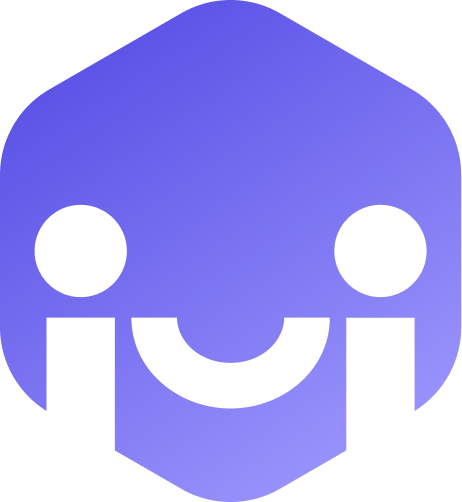

# Discord x Worldcoin

This project is a demonstration of serverless Discord Bot that uses [IDKit](https://github.com/worldcoin/idkit-js/) to verify humans. Verified humans get a special role assigned which can then be used to manage special permissions.

## Local development

For local development, you also will need [ngrok](https://ngrok.com/). After you log in, you can reach the [Setup & Installation](https://dashboard.ngrok.com/get-started/setup) section. There is an instruction on how to launch and configure `ngrok`

To create your own bot:

1. Clone repo.
2. Run `npm install`.
3. Run `npm run dev`. It will launch the app at `http://localhost:3000`.
4. Launch `ngrok`.
5. Run `ngrok http http://localhost:3000`.
6. After this ngrok shows you your tunneled link in the `Forwarding` field. It will be something like `https://9469-93-87-199-13.eu.ngrok.io`.
7. Go to [Discord Developer Portal](https://discord.com/developers).
8. Press the `New Application` button, set the app name, apply policies, and press `Create`.
9. At the `INTERACTIONS ENDPOINT URL` field paste.
   `<Your NGROK tunneled url>/api/interactions` and press `Save`.
10. Create a `.env.local` file in your directory and fill it with envs from `.env.local.example`.
11. `APPLICATION ID` and `PUBLIC KEY` you can find in the `General Information` section on Discord Dev Portal.
12. To get a bot token:
    - go to the `Bot` section
    - Press `Add bot`
    - Press `Reset Token`
    - Token will be visible after this
13. Go to OAuth2 -> General -> Redirects -> add `<localhost or NGROK tunneled address>/api/auth/callback/discord`
14. On the landing page press `Install now` button.
15. Install bot.
16. Try the `/verify` command.
