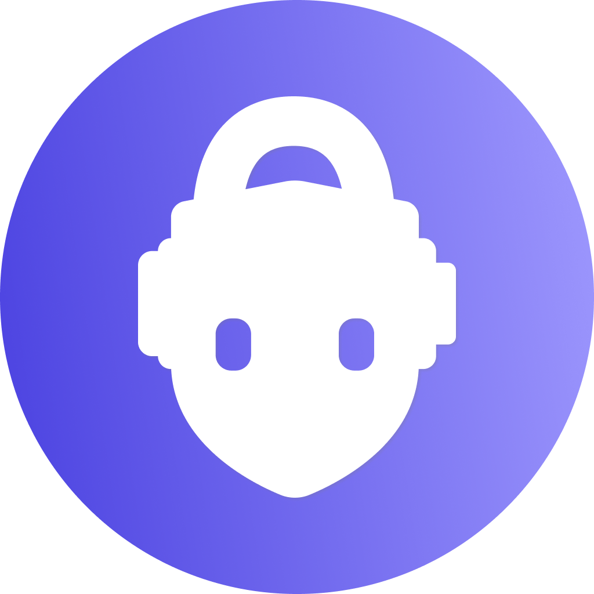

# World ID Discord Bot

This project is a demonstration of serverless Discord Bot that uses [World ID](#-about-world-id) to verify humans. Verified humans get a special role assigned which can then be used to manage special permissions.

Project is built using [AWS CDK](https://docs.aws.amazon.com/cdk/v2/guide/home.html) IaC and [projen](https://github.com/projen/projen#readme).

## 🚀 Using the bot

**Coming soon!** We are working on publishing this bot on Discord so it can be installed in your own server with one-click.  
You can deploy your own version in the meantime.

## 🏆 Deploying your own bot

### 1. Create an action on Developer Portal

1. Head over to Worldcoin's [Developer Portal](https://developer.worldcoin.org) and create an action.
2. You'll need to create an action that runs on **Cloud**. Select **Production** mode if you want to run it with actual human verification, otherwise use **Staging** to test with the simulator.

### 2. Bootstrap your Discord Bot App

1. Go to [Discord Developer Portal](https://discord.com/developers/applications) and create new application.
   - Take note of the application ID (e.g. `984381699360161823`)
2. Create a new Bot for the application and make sure your **save the Bot Token**!
   - Take note of the Bot public key (e.g. `aa4f7f5e1affd2c054ca07a2733007d44775826c821f6c0ddc3d3826a54eeb1a`)
3. Go to the OAuth2 page and create a client secret.
   - Take note of the OAuth2 client secret (e.g. `4CqPc0000UwqP1234Wd7r81kUm6k3LA`)

### 3. Deploy to AWS

1. Make sure you have [Node.js](https://nodejs.org) installed. Version **16.14.0** recommended (or above).

1. Install project dependencies

   ```sh
   npm install
   npx projen
   ```

1. Ensure you have latest version of [AWS CLI](https://aws.amazon.com/cli/) and configure your AWS CLI (we recommend you create a profile specific for your AWS account). If you create a named profile instead of using `default`, be sure to use that profile name in all `aws` or `cdk` commands below.

   ```sh
   brew update && brew upgrade awscli
   aws configure # or aws sso login (if applicable)
   ```

1. Create relevant secrets.

   a) Create secret with name `WorldIdDiscordBotToken` and the bot token as the value:

   ```sh
   aws secretsmanager create-secret --name WorldIdDiscordBotToken --description "Bot token for World ID Discord Bot" --secret-string <your 60+ chars long bot token saved during bot creation> --profile default
   ```

   b) Create secret with name `WorldIdDiscordBotClientSecret` and the OAuth2 client secret as the value:

   ```sh
   aws secretsmanager create-secret --name WorldIdDiscordBotClientSecret --description "Client secret for World ID Discord Bot" --secret-string <your bot client secret> --profile default
   ```

1. [_Optional, can be provided by CLI_] Set CDK Context values at `project.ts`

1. Install project dependencies:

   ```sh
   npx projen
   ```

1. Run CDK deployment (optionally overriding deployment values):

   ```sh
   npx cdk deploy
     --context bot_app_id=12345678 \
     --context bot_public_key=fdced6398cf4c6c96700069237df19ed393083f \
     --context roles_for_verified_user="Validated Human,World ID" \
     --context signal="<none>" \
     --context action_id="wid_XC36mm99KFeXh2p9P" \
     --profile=default
   ```

1. Grab `WorldID-Discord-Bot.discordbotapiEndpoint<some hash>` output (it should be an url similar to `https://3dhsrvte6f.execute-api.us-east-1.amazonaws.com/prod/`) and save it into <b>INTERACTIONS ENDPOINT URL</b> on your Bot settings at Discord Developers Portal.

   > If you are seeing `interactions_endpoint_url: The specified interactions endpoint url could not be verified` error during this step then make sure that you provided proper `bot_app_id` and `bot_public_key` CDK context values (carefully review steps above).

1. Grab `OAuth2CallbackUrl` output (similar to `https://2rrg16x6qh.execute-api.us-east-1.amazonaws.com/prod/oauth2callback`) and save it into `Redirects` field on the bot `OAuth2` settings.

1. Install the app in your Discord server.

<!-- WORLD-ID-SHARED-README-TAG:START - Do not remove or modify this section directly -->
<!-- WORLD-ID-SHARED-README-TAG:END -->
